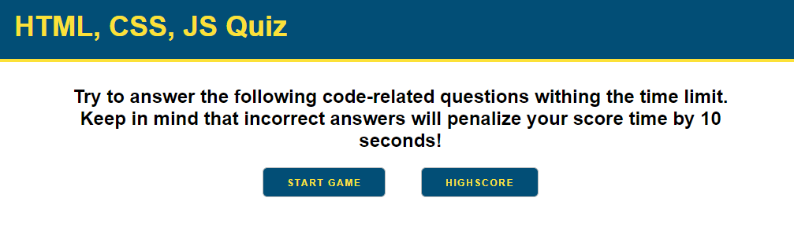
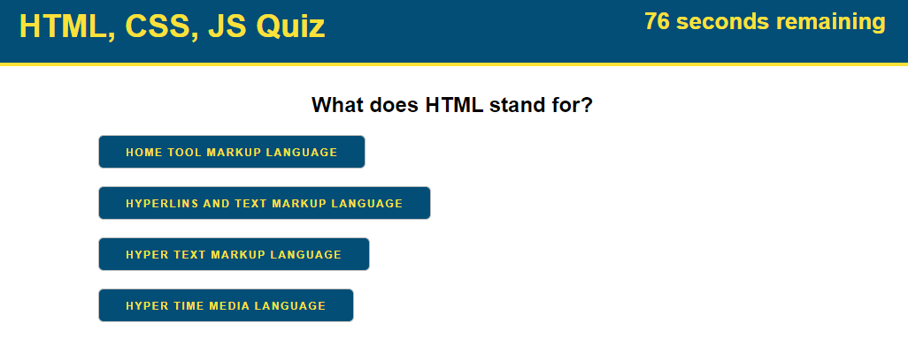
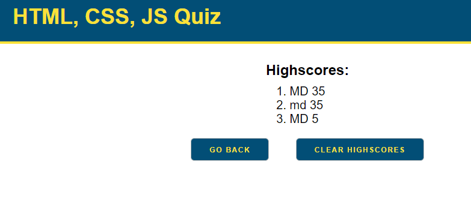

# Code Quiz
This is a simple coding quiz for HTML, CSS &amp; JS

## Description

This website will ask qneral questions to test your knowledge.
1. There are 5 questions that will need to be answered in 80 seconds
2. Each question has 4 choices
3. At the end you can save your score
4. Compare your score with other

## Criteria

GIVEN I am taking a code quiz 
WHEN I click the start button 
THEN a timer starts and I am presented with a question 
WHEN I answer a question 
THEN I am presented with another question 
WHEN I answer a question incorrectly 
THEN time is subtracted from the clock 
WHEN all questions are answered or the timer reaches 0 
THEN the game is over 
WHEN the game is over 
THEN I can save my initials and score 

## Screenshots

## Badges

  

## Deployment

[Code Quiz](https://matthewdamron.github.io/code-quiz/)